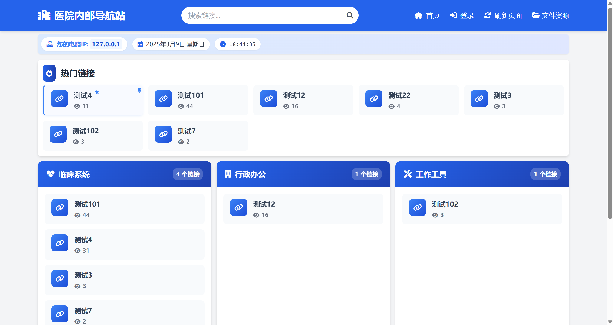

# 医院内部导航站

医院内部导航站是一个专为医院内部员工设计的网站导航系统，提供集中、高效的链接管理和资源访问平台。



## 功能特点

- 🔍 **分类浏览**：链接按照不同分类组织，便于查找
- 🔥 **热门链接**：自动展示点击量最高的链接
- 📌 **链接置顶**：重要链接可置顶显示
- 🔎 **实时搜索**：无刷新搜索体验
- 📁 **文件管理**：支持文件上传、下载和分享
- 👤 **用户管理**：用户认证和个人资料管理
- 📊 **使用统计**：记录链接点击和文件下载次数
- 📱 **响应式设计**：适配各种设备屏幕

## 技术栈

- **后端**：Django 5.1.7 + Django-Ninja
- **前端**：HTML + TailwindCSS + HTMX + JavaScript
- **数据库**：SQLite (开发) / PostgreSQL (生产)

## 安装指南

### 前提条件

- Python 3.10+
- pip
- Git

### 安装步骤

1. **克隆仓库**

```bash
git clone https://github.com/yourusername/hospital-navigator.git
cd hospital-navigator
```

2. **创建虚拟环境**

```bash
python -m venv venv
source venv/bin/activate  # Linux/Mac
# 或
venv\Scripts\activate  # Windows
```

3. **安装依赖**

```bash
pip install -r requirements.txt
```

4. **初始化数据库**

```bash
python manage.py migrate
```

5. **创建超级用户**

```bash
python manage.py createsuperuser
```

6. **收集静态文件**

```bash
python manage.py collectstatic
```

7. **启动开发服务器**

```bash
python manage.py runserver
```

现在，您可以访问 http://127.0.0.1:8000/ 查看网站，或访问 http://127.0.0.1:8000/admin/ 进入管理后台。

## 项目结构

```
hospital_navigator/
├── accounts/                  # 用户账户相关应用
├── navigator/                 # 主导航应用
├── hospital_navigator/        # 项目核心配置
├── static/                    # 静态文件
├── templates/                 # 全局模板
└── media/                     # 媒体文件存储
```

## 使用指南

### 管理员

1. **添加分类**：在管理后台创建链接分类
2. **添加链接**：为每个分类添加链接，设置标题、URL 和描述
3. **管理文件**：创建文件夹并上传文件
4. **用户管理**：创建和管理用户账户

### 用户

1. **浏览链接**：通过分类浏览或使用搜索功能查找链接
2. **访问文件**：浏览、下载和分享文件
3. **个人资料**：管理个人信息和部门职位

## 配置选项

主要配置文件位于 `hospital_navigator/settings.py`，可以根据需要修改以下设置：

- `DEBUG`：开发模式开关
- `ALLOWED_HOSTS`：允许访问的主机名
- `DATABASES`：数据库配置
- `STATIC_URL` 和 `MEDIA_URL`：静态文件和媒体文件 URL

## 部署指南

### 生产环境设置

1. **修改设置**

```python
# settings.py
DEBUG = False
ALLOWED_HOSTS = ['your-domain.com']
SECRET_KEY = 'your-secure-key'
```

2. **配置数据库**

```python
# settings.py
DATABASES = {
    'default': {
        'ENGINE': 'django.db.backends.postgresql',
        'NAME': 'hospital_navigator',
        'USER': 'db_user',
        'PASSWORD': 'db_password',
        'HOST': 'localhost',
        'PORT': '5432',
    }
}
```

3. **配置 Web 服务器**

推荐使用 Nginx + Gunicorn 部署：

```bash
# 安装Gunicorn
pip install gunicorn

# 启动Gunicorn
gunicorn hospital_navigator.wsgi:application --bind 0.0.0.0:8000
```

Nginx 配置示例：

```nginx
server {
    listen 80;
    server_name your-domain.com;

    location /static/ {
        alias /path/to/your/staticfiles/;
    }

    location /media/ {
        alias /path/to/your/media/;
    }

    location / {
        proxy_pass http://127.0.0.1:8000;
        proxy_set_header Host $host;
        proxy_set_header X-Real-IP $remote_addr;
    }
}
```

## 常见问题

**Q: 如何重置管理员密码?**  
A: 使用以下命令：`python manage.py changepassword admin`

**Q: 如何备份数据?**  
A: 使用 Django 的 dumpdata 命令：`python manage.py dumpdata > backup.json`

**Q: 如何恢复数据?**  
A: 使用 loaddata 命令：`python manage.py loaddata backup.json`
